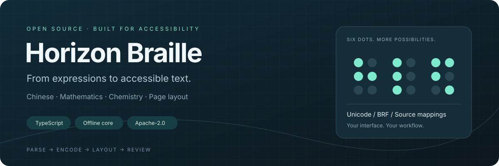
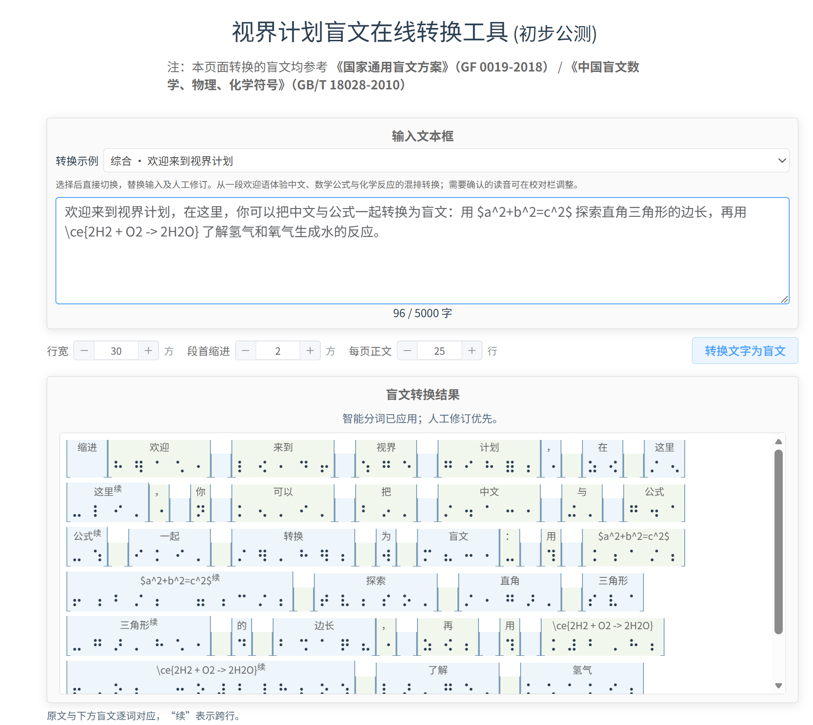
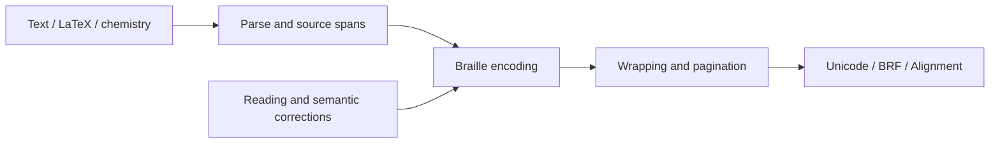

  
  
  
  

<strong>One core for text, formulas and accessible documents.</strong> Parse, encode, lay out and review braille in a single TypeScript pipeline.

<a href="README.md">中文</a> · <strong>English</strong> <a href="https://simpletex.cn/horizon_project">Try online ↗</a> · <a href="#quick-start">Quick start</a> · <a href="#editor-and-optional-services">Editor</a> · <a href="docs/api.md">API reference</a> · <a href="docs/standard-coverage.md">Supported profile</a> · <a href="CONTRIBUTING.md">Contribute</a>

---

## Braille building blocks for your application

Horizon Braille is an offline TypeScript library for braille conversion and layout. One pipeline handles mixed Chinese prose, mathematical expressions and explicit chemical formulas. It produces Unicode braille, BRF, paginated output and source-to-braille mappings. The core has no browser or online-model dependency; an editor, segmentation service and disambiguation service can be added separately.

## Try it online

**[Open SimpleTex · Horizon →](https://simpletex.cn/horizon_project)**

Explore mixed Chinese, mathematics and chemistry, word-by-word source alignment, reading corrections and layout exports. The screenshot shows the SimpleTex application built on the core. This repository contains the independent core and sample editor; the full hosted website interface and services are separate.

SimpleTex application preview · Click the image to try it

## Features

| Mixed input | Reviewable conversion | Application-ready output |
| :--- | :--- | :--- |
| Chinese, English and formulas in one document | Source-to-braille alignment | Unicode braille and BRF |
| Four LaTeX delimiters and common bare formulas | Manual readings, tones and word boundaries | Lines, pages and diagnostics |
| Fractions, roots, scripts and Greek letters | Optional semantic disambiguation | Reflow without re-encoding |
| Explicit `\ce{...}` chemical expressions | Source positions and surrounding context | ESM, CommonJS and type declarations |

Embed just the core, or build your own accessibility tools, educational applications and document workflows on the sample editor.

## Quick start

Use Node.js 22.13+ and npm:

~~~sh
git clone https://github.com/Surd-AI/horizon-braille.git
cd horizon-braille
npm ci
npm run build
npm run example
~~~

The build creates ESM, CommonJS and TypeScript declarations in `dist/core`. To consume this source build from another project, run `npm pack` and install the resulting `.tgz` package.

~~~js
import { convert, encodeDocument, reflowExistingAtoms } from 'simpletex-braille';
const result = convert('a²+b²=c²', { mode: 'math', columns: 30, rows: 25 });
console.log(result.unicode, result.brf, result.complete, result.diagnostics);
const encoded = encodeDocument('a²+b²=c²', { mode: 'math' });
console.log(reflowExistingAtoms(encoded, { columns: 40, rows: 25 }).lines);
~~~

`reflowExistingAtoms` changes layout without repeating reading decisions. See the [core API](docs/api.md) for input modes, output fields and source-span conventions.

## Editor and optional services

Run `npm run dev` and open http://127.0.0.1:5173 for the offline editor. `npm run build:playground` creates a standalone demo; `npm run build:browser` creates an embeddable editor. See [browser integration](docs/browser-editor.md).

For automatic online disambiguation, run `npm run start:api` in a second terminal and enter your SurdAI API Key in the page. [Register an account](https://surdai.com/zh/register), then [create a token](https://surdai.com/zh/platform/keys). A page-supplied key stays in page memory and is forwarded through the local service; server environment configuration is also supported. Online decisions transmit relevant text contexts.

This editor is an **algorithm preview for reference**. Build your own interface and business workflow on the core. Segmentation can connect to a separate service through `HORIZON_SEGMENT_URL`. Both services are optional; the core works without network access. See the [segmentation contract](docs/segmentation.md), [model service](apps/segmenter/README.md) and [disambiguation API](apps/api/README.md). The included API example binds locally and requires separate configuration for production.

## Verification and documentation

~~~sh
npm test
npm run typecheck
npm run verify:coverage
npm run test:package
~~~

The checks cover conversion rules, source spans, layout, the standards evidence registry and package consumption. Further reading: [mixed input](docs/mixed-input-policy.md) · [supported profile and review](docs/standard-coverage.md) · [standards sources](standards/README.md) · [verification](docs/verification.md) · [contributing](CONTRIBUTING.md) · [security](SECURITY.md).

The project draws on applicable rules from GF 0019-2018, GB/T 18028-2010 and GB/T 44725-2024. Review polyphonic readings, semantic ambiguities and complex layouts using `complete`, `diagnostics` and the source mappings. The [supported profile](docs/standard-coverage.md) records implementation and evidence per rule; software output is not official standards certification.

## Documentation

| Development and integration | Conversion and review |
| :--- | :--- |
| [Core API](docs/api.md) | [Mixed input policy](docs/mixed-input-policy.md) |
| [Browser editor](docs/browser-editor.md) | [Chinese word boundaries](docs/chinese-checked-joining.md) |
| [Segmentation](docs/segmentation.md) | [Chemical expressions](docs/chemistry-extended.md) |
| [Decision service](apps/api/README.md) | [Verification methods](docs/verification.md) |
| [Transcription skill](skills/chinese-braille-transcription/SKILL.md) | [Security](SECURITY.md) |

## Open source, ready to build on

Contributions with reproducible input, expected dot patterns, rule references and tests are welcome. Include conversion options and a minimal example when reporting an issue. See [CONTRIBUTING.md](CONTRIBUTING.md) for the workflow.

Licensed under **[Apache-2.0](LICENSE)**. Use, modify and integrate the core in your own products under its terms. See [NOTICE](NOTICE) and [third-party notices](THIRD-PARTY-NOTICES.md). Official standards scans, model weights and service credentials are not distributed in this repository.
