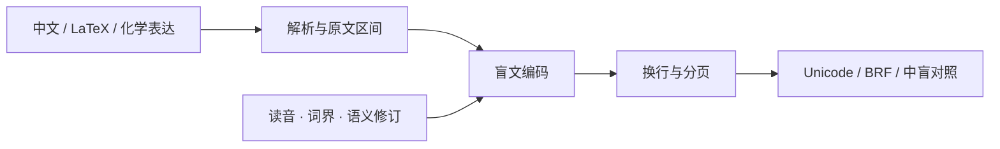

  
  
  
  

<strong>让文字、公式与知识，以盲文相遇。</strong> 一套可嵌入业务的 TypeScript 核心，一条贯通解析、编码、排版与校对的转换流程。

<strong>中文</strong> · <a href="README.en.md">English</a> <a href="https://simpletex.cn/horizon_project">在线体验 ↗</a> · <a href="#快速开始">快速开始</a> · <a href="#编辑器与可选服务">编辑器</a> · <a href="docs/api.md">API 文档</a> · <a href="docs/standard-coverage.md">支持范围</a> · <a href="CONTRIBUTING.md">参与贡献</a>

---

## 为你的应用提供盲文能力

Horizon Braille 是离线运行的 TypeScript 盲文转换与排版库。它用一条转换流程处理中文正文、数学公式和显式化学式的混排，输出 Unicode 盲文、BRF、分页结果及原文位置对照。核心不依赖浏览器或在线模型；编辑器、智能分词与消歧服务可按需接入。

## 在线体验

**[打开 SimpleTex · 视界计划 →](https://simpletex.cn/horizon_project)**

体验中文、数学与化学混排转换，以及逐词中盲对照、读音校对和排版导出。下图展示基于核心构建的 SimpleTex 在线应用；本仓库提供独立核心与示例编辑器，在线网站的完整界面和服务不包含在开源包中。

SimpleTex 在线应用实景 · 点击图片开始体验

## 核心能力

| 混合输入 | 可校对的转换 | 面向应用的输出 |
| :--- | :--- | :--- |
| 中文、英文与公式同段混排 | 中盲对照与原文区间映射 | Unicode 盲文与 BRF |
| 四种 LaTeX 定界符与常见裸公式 | 人工修订读音、声调与词界 | 行、页及诊断结构 |
| 分数、根式、上下标与希腊字母 | 可选智能消歧，保留人工控制 | 重新排版，无需重复编码 |
| `\ce{...}` 化学反应与元素表达 | 输入问题定位与上下文提示 | ESM、CommonJS 与类型声明 |

### 一条流程，连接内容与应用

你可以只使用核心，也可以基于示例编辑器开发无障碍工具、教学辅助应用或自己的文档流程。结果保留原文位置，改变版心时可以复用已经确认的编码。

## 快速开始

需要 Node.js 22.13+ 和 npm。克隆仓库后运行：

~~~sh
git clone https://github.com/Surd-AI/horizon-braille.git
cd horizon-braille
npm ci
npm run build
npm run example
~~~

构建产物位于 `dist/core`，提供 ESM、CommonJS 和 TypeScript 声明。要在其他项目中使用当前源码，可执行 `npm pack`，再安装生成的 `.tgz` 包。

安装包后：

~~~js
import { convert, encodeDocument, reflowExistingAtoms } from 'simpletex-braille';

const result = convert('a²+b²=c²', { mode: 'math', columns: 30, rows: 25 });
console.log(result.unicode, result.brf);
console.log(result.complete, result.diagnostics);

const encoded = encodeDocument('a²+b²=c²', { mode: 'math' });
const wider = reflowExistingAtoms(encoded, { columns: 40, rows: 25 });
console.log(wider.lines);
~~~

重排复用已编码内容，不重新判断读音。[核心接口](docs/api.md) 列出输入模式、返回字段和原文区间约定。

## 编辑器与可选服务

~~~sh
npm run dev
~~~

在 http://127.0.0.1:5173 打开独立编辑器。另运行 `npm run start:api`，在页面填入自己的 SurdAI API Key 后会自动在线消歧；本机服务不可用时会明确标示离线预览。`npm run build:playground` 构建独立演示，`npm run build:browser` 构建可嵌入网页的编辑器；详见[浏览器集成](docs/browser-editor.md)。

没有 Key？先[注册 SurdAI](https://surdai.com/zh/register)，再到[调用令牌](https://surdai.com/zh/platform/keys)页面创建。页面输入的 Key 仅保留在当前页面内存，经本机服务转发；也可通过服务端环境变量配置。在线判断会发送相关文本上下文。

| 你想做什么 | 入口 |
| :--- | :--- |
| 构建独立演示页面 | `npm run build:playground` |
| 嵌入现有网页 | `npm run build:browser` · [浏览器集成](docs/browser-editor.md) |
| 接入语义决策服务 | [消歧 API](apps/api/README.md) |
| 接入独立智能分词 | [分词协议](docs/segmentation.md) · [模型服务](apps/segmenter/README.md) |
| 让大模型理解转换与核对流程 | [盲文转换 Skill](skills/chinese-braille-transcription/SKILL.md) |

编辑器是**算法交互预览，结果仅供参考**。开发者可基于核心定制界面和业务流程。智能分词通过 `HORIZON_SEGMENT_URL` 接入独立服务；分词与在线消歧均可选，核心不需要网络。仓库自带的 API 示例绑定本机地址，生产部署需另行配置。

## 验证与文档

~~~sh
npm test
npm run typecheck
npm run verify:coverage
npm run test:package
~~~

这些检查覆盖转换规则、源码区间、排版、标准证据登记和独立打包导入。更多资料：[混合输入](docs/mixed-input-policy.md) · [支持范围与校对](docs/standard-coverage.md) · [标准来源](standards/README.md) · [验证方法](docs/verification.md) · [贡献指南](CONTRIBUTING.md) · [安全说明](SECURITY.md)。

项目参考 GF 0019-2018、GB/T 18028-2010 和 GB/T 44725-2024 中适用的规则。对于多音字、语义歧义和复杂版式，请结合 `complete`、`diagnostics` 与原文对照复核；逐条规则的实现及证据状态记录在[支持范围与校对](docs/standard-coverage.md)。软件输出不等于官方标准认证。

## 文档导航

| 开发与集成 | 转换与验证 |
| :--- | :--- |
| [核心 API](docs/api.md) | [混排输入策略](docs/mixed-input-policy.md) |
| [浏览器编辑器](docs/browser-editor.md) | [中文词界处理](docs/chinese-checked-joining.md) |
| [分词接入](docs/segmentation.md) | [化学表达](docs/chemistry-extended.md) |
| [消歧服务](apps/api/README.md) | [验证方法](docs/verification.md) |
| [贡献指南](CONTRIBUTING.md) | [安全说明](SECURITY.md) |

## 开源与共建

欢迎贡献可复现的输入、预期点位、标准依据与测试。提交问题时请附上转换选项和最小样例；新增规则与证据的流程见 [CONTRIBUTING.md](CONTRIBUTING.md)。

采用 **[Apache-2.0](LICENSE)** 许可。你可以依照许可使用、修改并集成核心，构建自己的产品。另见 [NOTICE](NOTICE) 与[第三方声明](THIRD-PARTY-NOTICES.md)。官方标准扫描件、模型权重和服务凭据不随仓库分发。
